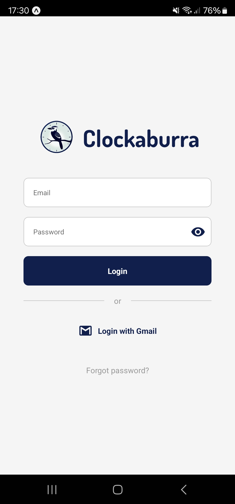
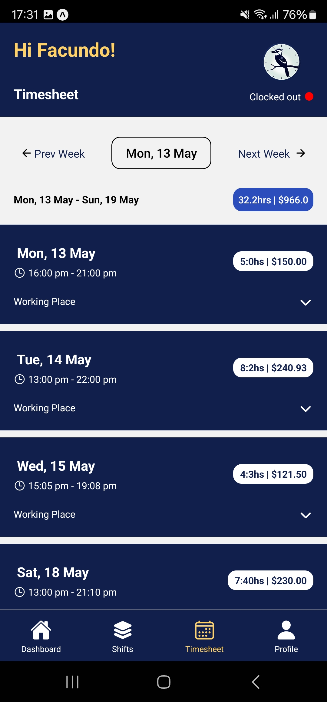
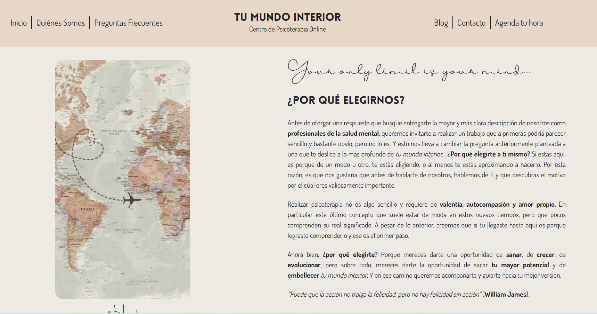
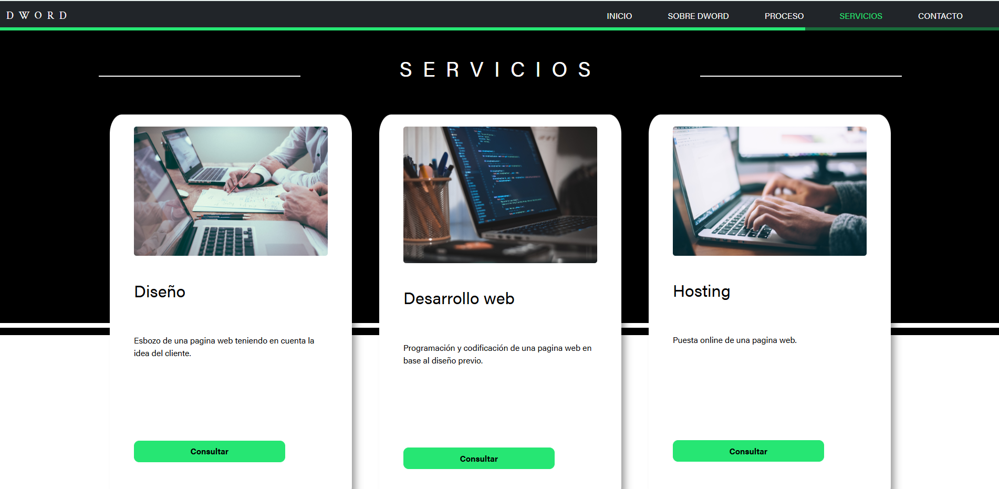

# Hi, I'm Facundo Villarroel 👋

### Full Stack JavaScript Developer

Building scalable web and mobile applications with React, React Native and Node.js, with a strong interest in software architecture and maintainable systems.

📍 Valencia, Spain  
🎓 Software Development Student  
💼 Looking for my first professional software developer opportunity

> Building software isn't just about writing code—it's about making decisions that keep systems simple, maintainable and ready to grow.

## About Me

I enjoy building software that solves real problems and can continue growing over time.

While developing my projects, I discovered that I particularly enjoy designing software architecture, creating maintainable systems and understanding the reasoning behind technical decisions rather than simply implementing features.

Most of my experience comes from building complete applications from scratch, where I worked across frontend, backend and mobile development, always trying to understand the reasons behind each technical decision rather than only the implementation itself.

I'm currently looking for my first professional opportunity as a Full Stack JavaScript Developer, where I can continue learning while contributing to real products.

## Technologies I Work With

### 💻 Frontend

React · React Native · Redux Toolkit · React Router · Styled Components · Tailwind CSS

### ⚙️ Backend

Node.js · Express.js · REST APIs · Firebase Authentication · JWT · Passport.js · Google Calendar API

### 💻 Programming Languages

JavaScript · TypeScript · Java · Python

### 🗄️ Databases

Firebase Firestore · PostgreSQL · MongoDB · MySQL

### 🛠️ Tools

Git · GitHub · Docker · Postman · Vercel · Netlify

## Projects I'm Most Proud Of

### 🚀 Clockaburra

  
  
  

A Full Stack employee management platform designed as a potential SaaS product, focused on scalable architecture, maintainability and reusable business logic.

The project consists of three independent applications sharing the same backend:

- 🔗 [Clockaburra REST API](https://github.com/FacundoVillarroel/Clockaburra-RESTful-API)
- 💻 [Clockaburra Web](https://github.com/FacundoVillarroel/Clockaburra-Web)
- 📱 [Clockaburra Mobile](https://github.com/FacundoVillarroel/Clockaburra-App)

**Main technologies**

React • React Native • Node.js • Express • Firebase • Redux Toolkit • TypeScript

---

### 🧠 Tu Mundo Interior

  

Website and appointment booking platform developed for a real client.

The project includes a self-managed blog, appointment scheduling and Google Calendar integration to prevent double bookings.

🔗 **Repository:**  [Tu Mundo Interior](https://github.com/FacundoVillarroel/tumundointeriorweb)

**Main technologies**

React • Node.js • Firebase • Google Calendar API

---

### 🎨 DWORD

  

Marketing website developed in collaboration with another frontend developer and two UX/UI designers.

Focused on responsive UI, reusable components and clean frontend architecture.

🔗 **Repository:**  [DWORD](https://github.com/FacundoVillarroel/Proyecto-Coder)

**Main technologies**

React • Styled Components • Responsive Design

## What I'm Looking For

I'm looking for my first opportunity as a Software Developer where I can continue growing while contributing to real products.

I'm particularly interested in projects involving:

- Full Stack development
- Web applications
- Mobile applications
- Software architecture
- Product development

## Let's Build Something Together

📍 Valencia, Spain

💼 [LinkedIn](https://www.linkedin.com/in/villarroelfacundo/)

📧 [facu.villarroel96@gmail.com](mailto:facu.villarroel96@gmail.com)

